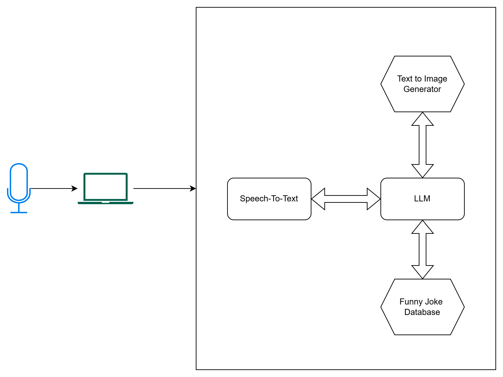

# Toy Agent

This agent is a demo that explores concepts in agentic AI workflow design and construction.

Key features:
- Context Management
  - Long term memory via DB
- Prompt and Response Guardrails
  - Prompt injection detection models
  - NSFW detection models
- LLM performance configuration
  - vLLM (Chunked prefill, paged attention, continuous batching)

